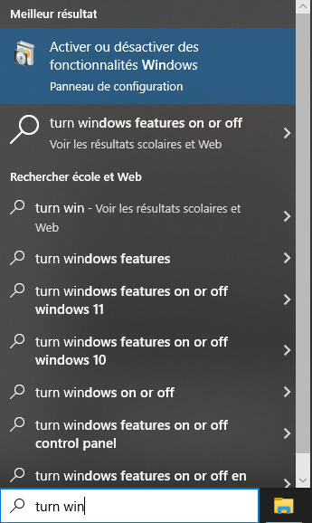
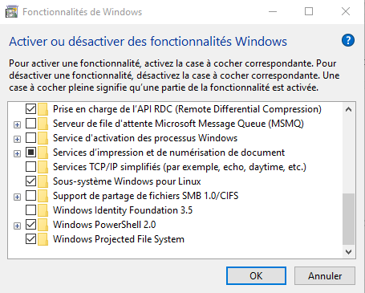

<a name="readme-top"></a>
<!-- TABLE OF CONTENTS -->
<details>
  <summary>Table of Contents</summary>
  <ol>
    <li>
      <a href="#prerequisites">Prerequisites</a>
      <ul>
        <li><a href="#wsl">Windows Subsystem for Linux</a></li>
        <li><a href="#blockchain">Blockchain</a></li>
        <li><a href="#token">Token</a></li>
        <li><a href="#smart-contracts">Smart contracts</a></li>
        <li><a href="#zero-knowledge-proof">Zero knowledge proof</a></li>
        <li><a href="#identity-models">Identity models</a></li>
        <li><a href="#know-your-customer">Know Your Customer</a></li>
        <li><a href="#airdrop">Airdrop</a></li>
        <li><a href="#dapps">dApps</a></li>
        <li><a href="#decentralized-identifiers">Decentralized Identifiers</a></li>
        <li><a href="#virtual-credentials">Virtual credentials</a></li>
        <li><a href="#digital-wallet">Digital wallet</a></li>
      </ul>
    </li> 
    <li>
      <a href="#privado-id">Privado ID</a>
      <ul>
      </ul>
    </li> 
    <li><a href="#contributors">Contributors</a></li>
  </ol>
</details>


<!-- PREREQUISITES -->
## Prerequisites

<!-- WSL -->
### Windows Subsystem for Linux

First of all, you will need a Unix-bases operating system to be able to run PrivadoID issuer node. To do so, we will install and use Ubuntu.

Search for Turn Windows features on or off :

<div align="center">
    
</div>

Activate Windows Subsystem for Linux and reboot your system when promped :

<div align="center">
    
</div>

Open your terminal and install this distribution as we've had dockers stability troubles with other versions : 

```
wsl --install -d Ubuntu-24.04
```

Update the subsystem :

```
wsl --update
```

<!-- Dockers -->
### Docker Desktop

To be able to execute the node's containers, install [Docker Desktop.](https://www.docker.com/products/docker-desktop/)

### Makefile toolchain

We will run the code with make commands. To be able to do so, first install Chocolatey via PowerShell with admin privileges :

```
Set-ExecutionPolicy Bypass -Scope Process -Force; [System.Net.ServicePointManager]::SecurityProtocol = [System.Net.ServicePointManager]::SecurityProtocol -bor 3072; iex ((New-Object System.Net.WebClient).DownloadString('https://community.chocolatey.org/install.ps1'))
```

And verify this installation :

```
choco --version
```

Install GNU Make :

```
choco install make
```

And also verify your installation :

```
make --version
```
