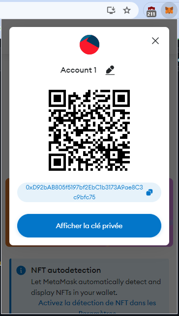
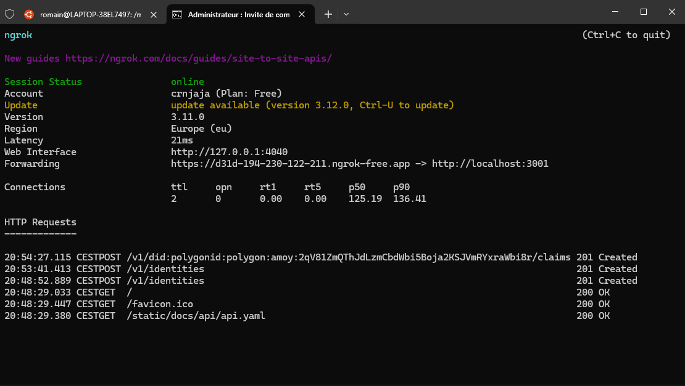
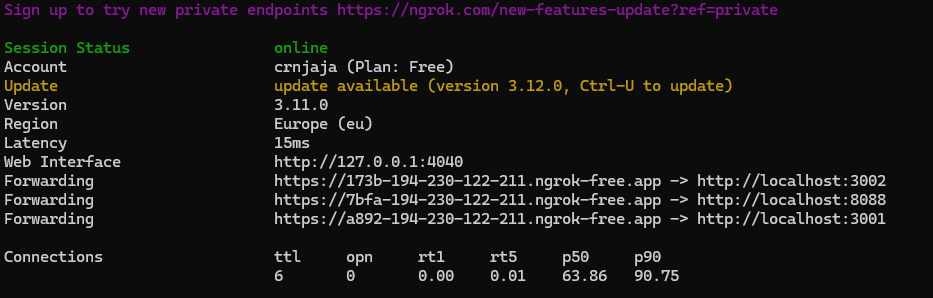

<a name="readme-top"></a>
<!-- TABLE OF CONTENTS -->
<details>
  <summary>Table of Contents</summary>
  <ol>
    <li>
      <a href="#environment">Environment</a>
      <ul>
        <li><a href="#windows-subsystem-for-linux">Windows Subsystem for Linux</a></li>
        <li><a href="#docker-desktop">Docker Desktop</a></li>
        <li><a href="#makefile-toolchain">Makefile Toolchain</a></li>
        <li><a href="#ngrok">Ngrok</a></li>
      </ul>
    </li> 
    <li>
      <a href="#issuer-node">Issuer Node</a>
      <ul>
      </ul>
    </li> 
    <li><a href="#contributors">Contributors</a></li>
  </ol>
</details>


<!-- ENVIRONMENT -->
## Environment

<!-- WINDOWS-SUBSYSTEM-FOR-LINUX -->
### Windows Subsystem for Linux

First of all, you will need a Unix-bases operating system to be able to run PrivadoID issuer node. To do so, we will install and use Ubuntu.

Search for Turn Windows features on or off :

<div align="center">
    
</div>

Activate Windows Subsystem for Linux and reboot your system when promped :

<div align="center">
    
</div>

Open your terminal and install this distribution as we've had dockers stability troubles with other versions : 

```
wsl --install -d Ubuntu-24.04
```

Update the subsystem :

```
wsl --update
```

<p align="right">(<a href="#readme-top">back to top</a>)</p>

<!-- DOCKER-DESKTOP -->
### Docker Desktop

To be able to execute the node's containers, install [Docker Desktop.](https://www.docker.com/products/docker-desktop/)

<p align="right">(<a href="#readme-top">back to top</a>)</p>

<!-- MAKEFILE-TOOLCHAIN -->
### Makefile toolchain

We will run the code with make commands. To be able to do so, first install Chocolatey via PowerShell with admin privileges :

```
Set-ExecutionPolicy Bypass -Scope Process -Force; [System.Net.ServicePointManager]::SecurityProtocol = [System.Net.ServicePointManager]::SecurityProtocol -bor 3072; iex ((New-Object System.Net.WebClient).DownloadString('https://community.chocolatey.org/install.ps1'))
```

And verify this installation :

```
choco --version
```

Install GNU Make :

```
choco install make
```

And also verify your installation :

```
make --version
```

<p align="right">(<a href="#readme-top">back to top</a>)</p>

<!-- NGROK -->
### Ngrok

The issuer node API must be publicly reachable. We will use ngrok as tunneling service. Download and unzip it with your terminal :

```
Invoke-WebRequest -Uri "https://bin.equinox.io/c/4VmDzA7iaHb/ngrok-stable-windows-amd64.zip" -OutFile "ngrok-stable-windows-amd64.zip"
```
```
Expand-Archive -Path "ngrok-stable-windows-amd64.zip" -DestinationPath "C:\ngrok"
```

Add ngrok to your PATH : 

- Open System Properties (Win + Pause/Break).
- Click on "Advanced system settings".
- Click on "Environment Variables".
- Under "System variables", find the "Path" variable, select it, and click "Edit".
- Click "New" and add the path to the ngrok directory, e.g., C:\ngrok.
- Click "OK" to close all windows.

And verify your installation :

```
ngrok version

```

<p align="right">(<a href="#readme-top">back to top</a>)</p>

<!-- ISSUER-NODE -->
## Issuer Node

In this chapter, we will install and setup the issuer node.

Firstly, clone the official issuer-node repo on your Windows environnement :

```
cd C:\Users\romai\Desktop\
```

```
gh repo clone 0xPolygonID/issuer-node
```

And copy and rename all 3 .env sample files :

```
cd C:\Users\romai\Desktop\issuer-node
```

```
cp .env-api.sample .env-api
cp .env-issuer.sample .env-issuer
cp .env-ui.sample .env-ui
```

With your favorite IDE, edit the `ISSUER_ETHEREUM_URL=` variable inside the `.env-issuer` file with your Remote Procedure Call, essential for communication between the client the blockchain network. I will be using [ankr.](https://www.ankr.com/)

Start Docker Desktop and within your Ubuntu environment, point to your issuer-node directory and start the infrastucture :

```
cd /mnt/c/Users/romai/Desktop/issuer-node
```

```
make up
```

Add your crypto wallet to the vault. We will be using a [MetaMask](https://metamask.io/) wallet. Open the extension, login and retrieve your private key from your account settings :

<div align="center">
    
</div>

```
make private_key=<your private key> add-private-key
```

To add a token to the `ISSUER_KEY_STORE_TOKEN=` variable inside the `.env-issuer` file, enter :

```
make add-vault-token
```

Generate an Issuer DID

```
make generate-issuer-did
```

Run the api and ui :

```
make run
```

```
make run-ui
```

You can reach the issuer api on `http://localhost:3001` with the login `user-issuer` and password `password-issuer`

You can reach the ui api on `http://localhost:3002` with the login `user-api` and password `password-api`

You can reach the ui on `http://localhost:8088` with the login `user-ui` and password `password-ui`

The issuer api need to be tunneled :

```
ngrok http 3001
```

Giving you a unique URL :

<div align="center">
    
</div>

To be able to tunnel multiple port at once with the free solution, first check where the `ngrok.yml` file is located :

```
ngrok config check
```

Add this under your version and authtoken variables :

```
tunnels:
  app3001:
    addr: 3001
    proto: http
  app3002:
    addr: 3002
    proto: http
  app8088:
    addr: 8088
    proto: http
```

Save and start it :

```
ngrok start --all
```

Giving you a unique URL for each port

<div align="center">
    
</div>
